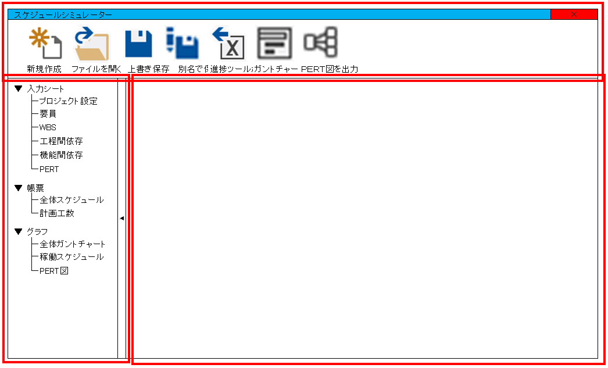

# 2. 画面説明

## 画面イメージ

## 1.共通部分

画面の外郭、フレーム構造とかの説明。

### 1.1. メニュー部分

上についてるボタンが並んでいるやつ、ファイルの入出力とかする時に使うボタンをとりあえず並べておく。



### 1.2. 左サイド部分

左に出ているパネル。画面の選択に使う。



### 1.3. メインコンテンツ表示部分

画面ごとにいろいろ表示する。画面ごとの説明は↓に書く。



## 2. 入力シート

ユーザがデータ入力するときに使う画面たち。

### 2.1. プロジェクト設定

プロジェクトの期間、作業工程、機能、休日設定を入力する。他にもプロジェクト全体に影響しそうな情報があればこの画面に追加する。



### 2.2. 要員

プロジェクトに従事するリソースを入力する。



### 2.3. WBS

タスクを入力する画面。よく使われてる表のイメージ。



### 2.4. 工程間依存

作業工程間に依存関係がある場合にそれを入力する画面。工程間の依存関係とはこの作業工程が完了しないとこっちの工程が開始できない。とかそういうやつ。



### 2.5. 機能間依存

機能間に依存関係がある場合にそれを入力する画面。機能間の依存関係とは（略）



### 2.6. PERT

タスク間に依存関係がある場合にそれを入力する画面。他の入力画面と少し毛色が異なり、PERT上のフロートやクリティカルパスを表示する。



## 3. 帳票

ユーザが見たい情報を表示する画面その１。基本的に入力操作は行わない。主に表とかテキストベースの何かの表示を想定。

### 3.1. 全体スケジュール

工程ごとの開始予定日と終了予定日を表示する。それだけ。



### 3.2. 計画工数

日付×工程ごとにBAC\(Budget at Completion\)とPV\(Planned Value\)の一覧を表示する。PVはこの日の時点で終わってなければならない作業量。BACはプロジェクト完了時点でのPVの値を想定。EVMで調べよう。



## 4. グラフ

ユーザが見たい情報を表示する画面その２。帳票とは異なり多少情報入力しつつ入力内容から各種グラフを生成&表示する。

### 4.1. 全体ガントチャート

WBSで入力されている情報をもとにガントチャートを表示する。それだけ。実績入力とかはしない。



### 4.2. 稼働スケジュール

WBSで入力された情報をもとに一人一人の日々の作業予定量とかトータルの作業量をグラフに表示する。



### 4.3. PERT図

PERTで入力された情報をもとにPERT図を表示する。エッジ=タスクの図を表示する想定。



